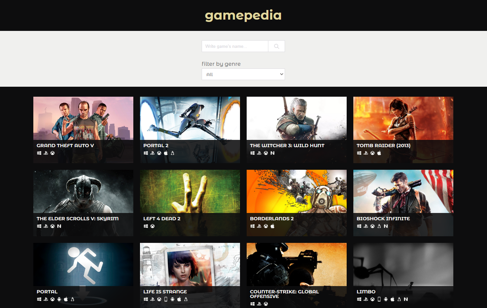

# gamepedia

> The objective of this repo is to build an app based on a "Catalogue of Recipes". 

The app is called "gamepedia" which displays a browsable list of videogames that the user can filter, access the details of each one, and can also search for games by title. 

The main requirements were: 
* The web app should have at least two types of pages:  
        a. One with a list of items that could be filtered by some parameters.  
        b. Another for the item details. 
* It should collect the data from an API from the React application.

## :camera: Screenshot

  

## :hammer:  Built With

- NPM,
- Nodejs,
- Yarn,
- Eslint,
- Stylelint,
- Sass,
- Jest,
- React,
- Redux,
- JavaScript,
- Visual Studio Code

## :earth_americas: Live Demo

You can try it [here](https://rossielcs-catalogue-of-games.herokuapp.com/).

## :computer: Getting Started

To get a local copy up and running follow these simple example steps.

### Prerequisites
Before you continue, be sure that you have installed:

- A Git GUI.
- [NPM](https://www.npmjs.com/get-npm).
- [Nodejs](https://nodejs.org/en/).
- An Integrated Development Environment.
- A web browser.

### Usage
To run the project:

- Clone the repository with Git.
- Open it with your IDE.
- Install the dependencies.  
`npm install`
- Run the app in development mode. 
`npm run start` 
Open [http://localhost:3000](http://localhost:3000) to view it in the browser. 
The page will reload if you make edits.

### Deployment
Instructions from [Heroku Buildpack](https://github.com/mars/create-react-app-buildpack).

- Generate a react app. 
*replace $APP_NAME with the name for your unique app*. 
`npx create-react-app@3.x $APP_NAME`

- Create the heroku app. 
*replace $APP_NAME with the name for your unique app*. 
`heroku create $APP_NAME --buildpack mars/create-react-app`

- Deploy. 
`git push heroku master`

- Visit the app's public URL in your browser. 
`heroku open`

## :gem:  Features
1. It displays the most popular games.
2. The game's list can be filtered by genre.
3. The user can search a game by title.
4. When the user clicks on a game, it loads a webpage with the details of the item.

## :memo: Tests
It contains unit tests for:
  * Presentational components.
  * Containers.
  * Action creators.
  * Reducers.
  * Helpers.

To run the tests.   
`npm run test`

## :woman:  Author

**Rossiel Carranza**

- Github: [@RossielCS](https://github.com/RossielCS)
- LinkedIn: [Rossiel Carranza](https://www.linkedin.com/in/rossiel-carranza/)

## 🤝 Contributing

Contributions, issues, and feature requests are welcome!
Feel free to check the [issues page](issues/).

1. Fork this repository.
2. Create a branch: git checkout -b <branch_name>
3. Make your changes and commit them: git commit -m '<commit_message>'
4. Push to the original branch: git push origin <project_name>/<location>
5. Create the pull request.

## Show your support

Give an ⭐️ if you like this project!

## Ackowledgments

This app uses [RAWG](https://rawg.io/) as a source of the data and/or images. 
Design based in [NomNom](https://www.behance.net/gallery/11351281/NomNom) by [Marc-Antoine Roy](https://www.behance.net/enfantroy).

## 📝  License

This project is [MIT](lic.url) licensed.
